# Project 2: Android Memory Management

Zihan Wang Student ID: 517021911179

## Contents

[TOC]

## 1 Get the physical address of a target process

### 1.1 Investigate page table layout

#### 1.1.1 Analysis

The address shift amount of the three levels are defined as macros (`PGDIR_SHIFT`, `PMD_SHIFT` and `PAGE_SHIFT`) in the kernel header `asm/pgtable.h`. However, the user program does not have access to these data. As a system call, it just needs to copy these data into the fields of `pagetable_layout_info`.

#### 1.1.2 Implementation

The procedure is simple, so there are few words on it. The system call (number 375) is implemented in `src/layout`.

### 1.2 Map page tables into current process’s address space

#### 1.2.1 Analysis

To map page tables of a certain process into current process’s address space, we have to firstly understand where the page tables are stored in memory. In the Linux kernel, each process corresponds to a process control block `task_struct`. Within each `task_struct`, there’s a memory descriptor `mm_struct` which contains all the memory management information related to this process. Each process has its own virtual address space, so in each `mm_struct` there is a pointer to the highest level of page table directory `pgd`. This specifies the mapping of virtual addresses to physical addresses. Within each `mm_struct`, there’s also a pointer pointing to the linked list of several `vm_area_struct`. A `vm_area_struct` is the basic memory management unit that describes a continguous virtual memory area with the same access properties. 

We have to be clear that we want to map page *tables*, not page *contents*. In the Linux kernel, page tables are stored in kernel space. The physical addresses (not virtual ones, since there’s no address mapping in kernel space) of lower page tables can be found by checking the value of higher page tables. Moreover, the minimum unit of memory mapping is a page, so each time we map at least a *page* of page tables into current process’s address space, not a single page table entry. From `asm/pgtable.h` we know that the lowest level of page table has 512 entries. We are working on a 32-bit systen, so each lowest level of page table is 2KB, just half the size of a page. By further investigating the page table entries, I find that the page table only occupies the lower half of a page, and the higher is left empty. Therefore, each time I map a page of page table entries, I can map a single but complete page table. 

#### 1.2.2 Implementation

The system call (number 376) is implemented in `src/expose`. 

The system call does the following things: It first gets the `task_struct` from given `pid` of the target process. Besides, the program gets `vm_area_struct` from `fake_pgd`, `fake_pmds` and `page_table_addr` respectively in the address space of current process and sets flag `VM_DONTEXPAND` to prevent it from being merged with other `vm_area_struct`s. The program allocates a temporary space for fake PGDs and PMDs in kernel space. Then the program traverses all the `vm_area_struct` in the `mm_struct` of target process and finds all the PGDs the virtual address space covers. Since the kernel we operated on has only two levels of page tables, we just need to focus on PGDs, and PMDs can be ignored. Once the program finds a different PGD, it maps the page of the page table into user space. Here I did not use the function `remap_pfn_range` mentioned in the hints, because it suits the task of  remapping multiple pages. For a single page, `vm_insert_page` could be a better choice. After mapping pages tables, the entries in fake PGDs and fake PMDs should also be set to point to the correct page tables. Finally, fake PGDs and fake PMDs are copied into user space using `copy_to_user` and the memory allocated in kernel space is freed.

### 1.3 `VATranslate`

#### 1.3.1 Analysis

The program should translate the virtual address in the address of space of a process to physical address, or reports failure if it cannot complete this task. Fortunately, I have already implemented `expose_page_table` system call in the previous part. I just need to map part of page table of the target process into the address space of `VATranslate` and check the remapped page tables to find the physical address.

#### 1.3.2 Implementation

The program `VATranslate ` is implemented in `src/VATranslate`. 

Since we have to test both system calls, the address shift amounts of page directories can not be hardcoded into the program. Instead, the program calls `get_pagetable_layout` (system call number 375) to get the three shift amounts, and use these amounts to `malloc` fake PGDs and fake PMDs and `mmap` remapped PTEs. Then the program calls `expose_page_table` (system call number 376) to maps the page table this virtual address related to. Finally it goes through the three levels of page table and finds the physical address, if possible, and reports failure if any level of the page table if empty. 

#### 1.3.3 Output

Here I choose the `logd` (pid 60) to be the target process. With the help of `/proc/60/maps` I can find the virtual memory space of this process. I test both valid and invalid virtual addresses respectively, and the programs output is shown below. 

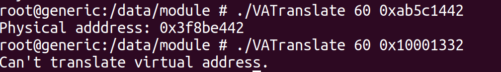

## 2 Investigate Android process address space

### 2.1 `vm_inspector`

#### 2.1.1 Analysis

The program `vm_inspector` should dump all the valid page table entries within the given range. This is similar to the `VATranslate` in that they all have to access the remapped page tables, so I omit the discussion of the mechanism of this `vm_inspector` here.

#### 2.1.2 Implementation

The program `vm_inspector` is implemented in `src/vm_inspector`.

The main difference between `vm_inspector` and `VATranslate` is that `vm_inspector` should cover all the valid page table entries, so I add a loop of the virtual address to the program. Others are already discussed in `VATranslate`.

#### 2.1.3 Output

Again I choose `logd` to be target process. The program can successfully dump all the valid page table entries. Since the page table entries are quite long, the following picture shows only part of them. 

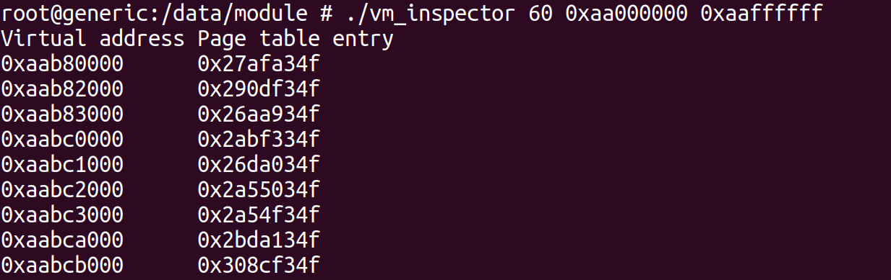

Note that the lower 3 digits of the hexadecimal entries (or lower 12 bits in the binary form) are not zero, but some seemingly meaningful digits. I guess the these digits are used by the Linux kernel to record the states of the pages. 

### 2.2 Investigation

#### 2.2.1 Changes in the PTE dump of an Android app

In this part, I should play with an Android app and dump the PTEs of this app multiply times to see the changes. Here I choose the built-in clock app. To change the state of this app, I add some alarms and modify some settings.

Since a page is only 4KB large and an app may occupies tens of megabytes, I choose not to print all the PTEs. Instead, I first check `proc/#pid/maps`, and just dump the part I’m interested in. Here I mainly focuses on the anonymous pages, because they are usually dynamically allocated memory and tend to change frequently, while mapped pages are usually mapped to library files, which are unlikely to be changed. 

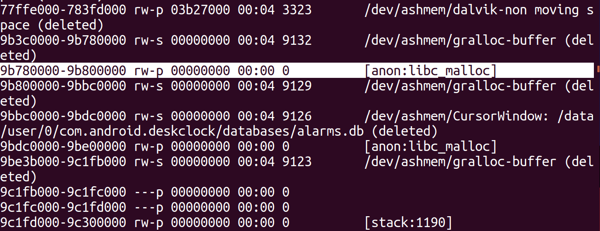

I dump the PTEs several times in a certain address range and find some changes of the page table. Some PTEs are added to the dump, some remain, while some are removed from the dump. The following screenshot shows two PTE dumps of built-in clock app in address range `0x9b780000-0x9b800000`.

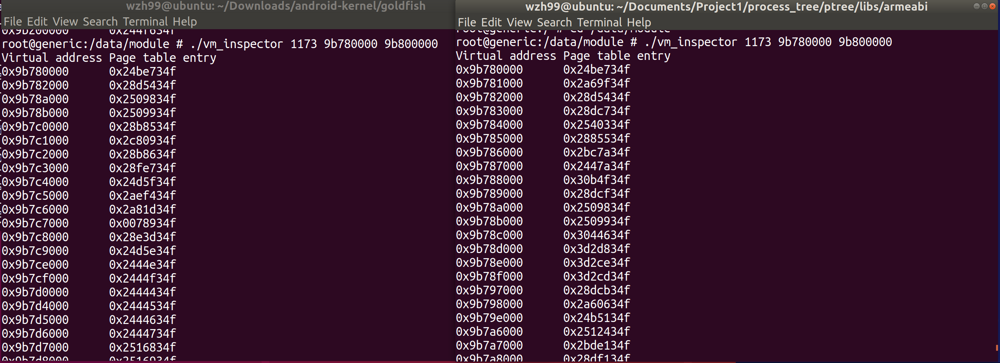

#### 2.2.2 Comparison of PTE dump between an Android app and Zygote

At the beginning of this task, I first try to find some introduction about Zygote, including what role this app plays in the Android operating system and how this app is related to other Android apps. In [3], I can get a general idea of these problems. Zygote is a special Android process that enables shared resources among different processes. When the system is booting, a Zygote process is created. It loads code and data an Android app or service may need and waits for request to start apps or services. When a request is received, it forks a child process and starts the app or service. Therefore, all the app and service processes are children of Zygote. They share some resources with Zygote and ‘develop’ from it, so this is where the name of this app comes from.

From the introduction above, I can roughly know what the common and different parts I expect to find. I first use `/proc/#pid/maps` to find whether have virtual memory area mapped to the same file, and then use `vm_inspector` to see whether there are some differences in the PTE dump of this area. 

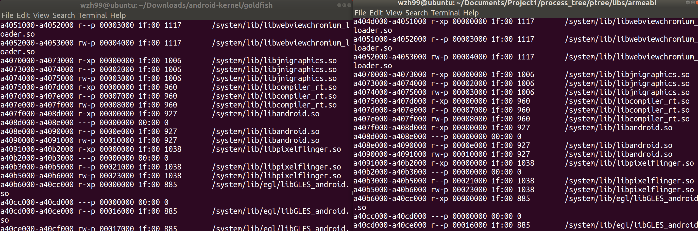

The screenshot above shows the comparison of the memory maps information between Zygote (left) and an Android app. I can find many shared files between two processes. From my observation, there are two main kind of files shared between an Android app and Zygote: dynamically linked libraries (for example, `libandroid.so`, `libstdc++.so`, `libjnigraphics.so`) and font files located in `/system/fonts`. 

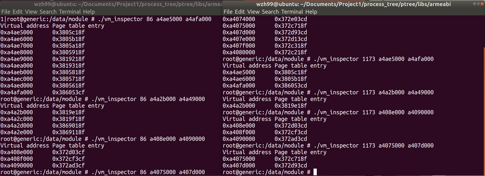

Then I pick some of the shared files and dump their PTEs of the virtual memory space mapped to each file. The left is Zygote and the right is an Android app. It can be found that for each file, there are always pages that maps to the same frames. This means that there’s only one copy of the file in the memory and it is shared by several processes. This is exactly the duty of Zygote. Also note that there are some pages in the address space of Zygote but not in the one of an Android app. This means that a specific Android app may not need all the contents of a file, but Zygote has to prepare all the contents in case it is used by some process. Another observation is that there are some PTEs in the dump of both processes that are mapped to the same frames (higher 20 bits are the same), but are different in flags (lower 12 bits). 

## 3 Change Linux page replacement algorithm

### 3.1 Analysis

In this part I replace the original page replacement algorithm in Android kernel, which is a combination of LRU and Second Chance with a new one based on LFU (least frequently used). To replace the algorithm, I have to firstly understand the mechanism of page replacement in the kernel. I browse source code mainly in `mm` directory and try to find the functions related to page replacement. From my observation, I find the function calling procedure slightly different from the one introduced in the project guide. I combine the introduction in [1] with my own observation and draw the function calling diagram in the following figure.

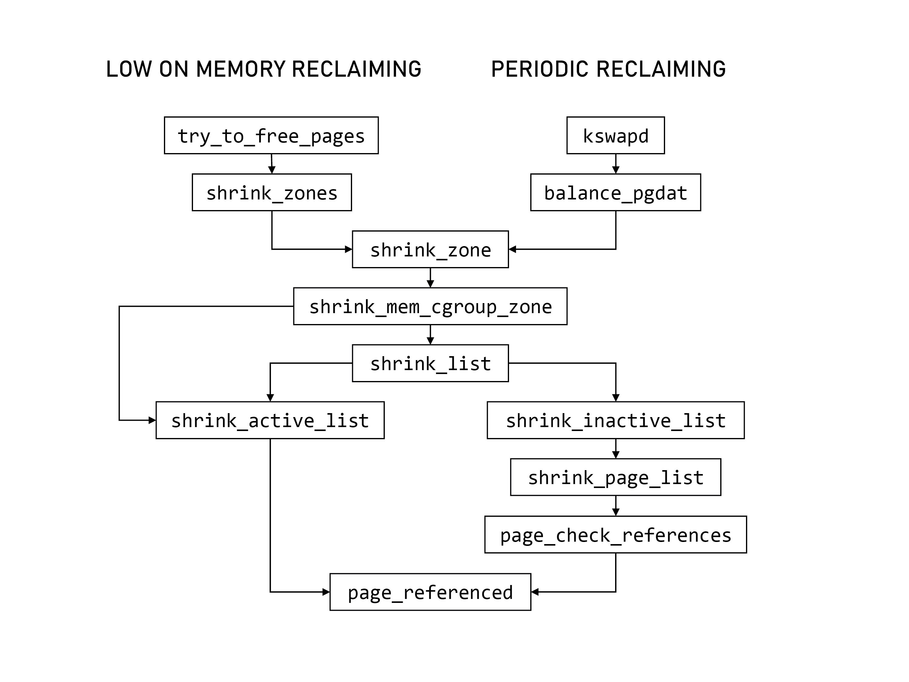In the Linux kernel, there are two main conditions when page replacement algorithm will be invoked. When the system is low on memory (finds it hard to allocate more pages), `try_to_free_pages` will be called. Also, the system runs a daemon `kswapd` to periodically check the number of free pages and swap pages if necessary. Maintainance of two LRU lists, active and inactive, is initiated by `shrink_list`, and is executed by `shrink_active_list` and `shrink_inactive_list`, respectively. They depend on the page reference information provided by `page_referenced`. 

After having a overview of the functions that perform page replacement, I have to find out functions that change the reference bit of the pages (functions containing code like `SetReference` or `ClearReference`). Since in the new algorithm we don’t care about this reference bit, but focuses on the `PG_referenced` member of a page, these functions should be modified. There’s a diagram in the project guide illustrating the states in the original algorithm. That diagram gives four functions related to the state transition of pages. My inspection of the source code shows that `page_referenced` just return a reference count and `active_page` just set the active bit and add the page to the active list. These two functions have nothing to be modified. `mark_page_accessed` is called when a page is accessed. This function operates on the reference bit. `shrink_active_list` tries to move some pages in the active list to the inactive list. This function also operates on the reference bit. Besides, I find that `page_check_references` also changes the reference bit, though not mentioned in the diagram. These three functions are the main focuses of my implementation. 

### 3.2 Implementation

Now I have to consider how to modify the three functions. The principle here is to find the relevance between the original and new algorithm, and replace the corresponding part. Although the strategies of LRU and LFU are different, the procedures of both algorithms are similar. This method help reserve the logical structure of the kernel function as much as possible, thus ensuring successful implementation. The four main tasks of algorithms and the functions that implement them are listed in the following table. 

| Task                 | LRU with Second Chance                                       | LFU                                          | Function                                |
| -------------------- | ------------------------------------------------------------ | -------------------------------------------- | --------------------------------------- |
| Mark accessed pages  | Set `PG_referenced` if 0  Clear it and add page to active list if 1 | Left shift `PG_referenced` and add by offset | `mark_page_accessed`                    |
| Age pages            | Clear `PG_referenced` if 1  Set it and add page to inactive list if 0 | Right shift `PG_referenced`                  | `page_check_references`                 |
| Add to active list   | `PG_referenced` is 1 and referenced recently                 | `PG_referenced` is above some threshold      | `mark_page_accessed` `activate_page` |
| Add to inactive list | `PG_referenced` is 0 and not referenced recently             | `PG_referenced` is below some threshold      | `shrink_active_list`                    |

Then I will specify other details not mentioned in the previous part. For the offset to add to `PG_referenced` when marking accessed pages, I set this value to be $2^0=1$. This offset can turn a zero `PG_referenced` to be 1 (otherwise it will always be zero, no matter being shifted by any time), but has no effect on the higher bits. This prevent judging the special case for zero. I also set a max limit for `PG_referenced`. This is because `mark_page_accessed` runs when system is started, but `shrink_zone` are called only when free pages are insufficient. At limit, `PG_referenced` could reach `0xffffffff`, which need many times to add this page to inactive list.  The exact value of the threshold and max limit are not fixed then. 

The modified kernel source files are in directory `src/kernel`, file `modification.txt` shows the modified files in detail.

### 3.3 Test

#### 3.3.1 Invoke the page reclaiming procedure

In Section 3.1 I mentioned that the place reclaiming procedure can only be executed when the free pages are not enough. When the page numbers are fairly enough, only `mark_page_accessed` will be executed. To fully test the algorithm, I have to write a program `pra_test` to occupy as much memory as possible, so as to invoke `kswapd`. However, `kswapd` not only reclaim pages, but also executes `lowmemkiller` to kill some processes. During my test, reclaiming pages and killing processes always happen simultaneously. If the memory space `pra_test` occupied hasn’t reached a certain limit, the page reclaiming procedure will not start. But if the limit is reached, `lowmemkiller` will kill `pra_test`. Therefore, I cannot keep `pra_test` running while the pages are being reclaimed. This hinders me to further test the performance of page replacement algorithm. 

#### 3.3.2 Log sizes of active and inactive lists

To get statistics of the active and inactive pages when the test program is running, I have to frequently access `/proc/meminfo` to get the information. However, manually type this is slow and tedius, so I write a program `meminfo` that periodically access `/proc/meminfo`, reads the size of active and inactive pages respectively, and print the number in a format that makes it easy for later processing. 

The program `meminfo` is implemented in `test/meminfo`.

#### 3.3.3 Result

Firstly I print kernel messages when a page is put into active or inactive list. I can see `page # -> active` messages since the system is started. Then I run `pra_test` to invoke the page reclaiming procedure. After a few seconds, I can see both `page # -> active` and `page # -> inactive` messages. This mean that my algorithm can move pages between the two lists.

Then I try to log the sizes of active and inactive lists and plot them in graphs. These tests cover the modified LFU-based algorithm with several alternative parameters (threshold and max limit). Besides, the data of original LRU-based algorithm is also plotted as a reference.

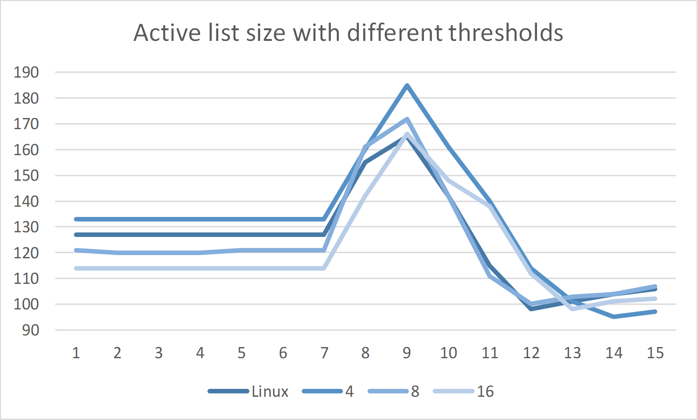

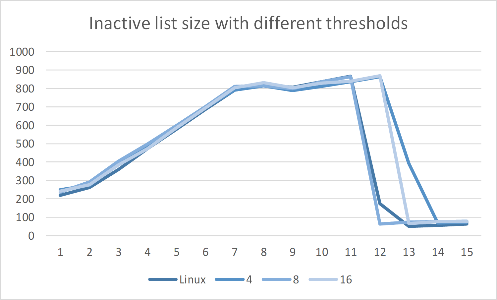

Let’s first look at the rough trend of the list size curve. In the first six seconds, the inactive list continues to grow, while the active list remains. This is because `pra_test` access every page only once. At the seventh second, the inactive list grows more slowly, and the active list begins to grow. At the ninth second, the active list size reaches a peak. The page reclaiming procedure is started then. At the eleventh second, the inactive list size begins to dive. This may be due to the invocation of `lowmemkiller`.

I firstly consider the impact of `PG_referenced` threshold on the size of lists. The smaller the threshold, the larger the active list. With smaller threshold, the pages are more likely to be added to the active list. I also find the variance of the data in LFU algorithm to be slightly larger than the original Linux algorithm. However, I cannot explain this phenomenon. As for the inactive list, the growing speed is similar. The only difference is the time it drops. I cannot find any regularity here, and guess maybe it’s because of the hardware performance.

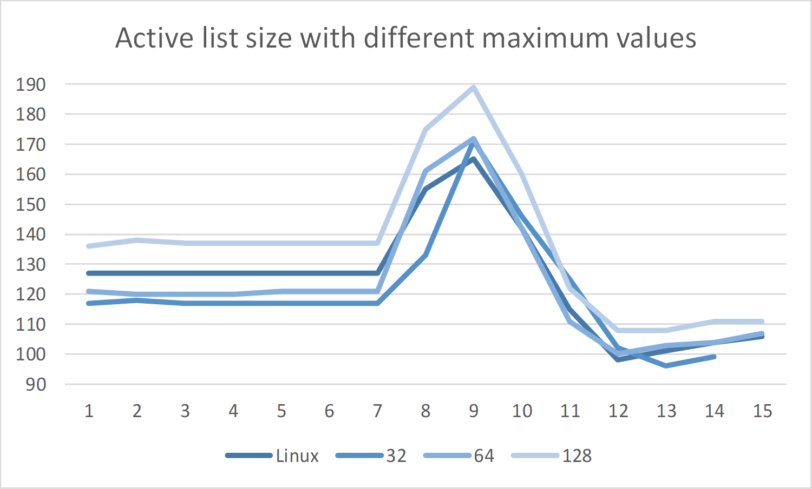

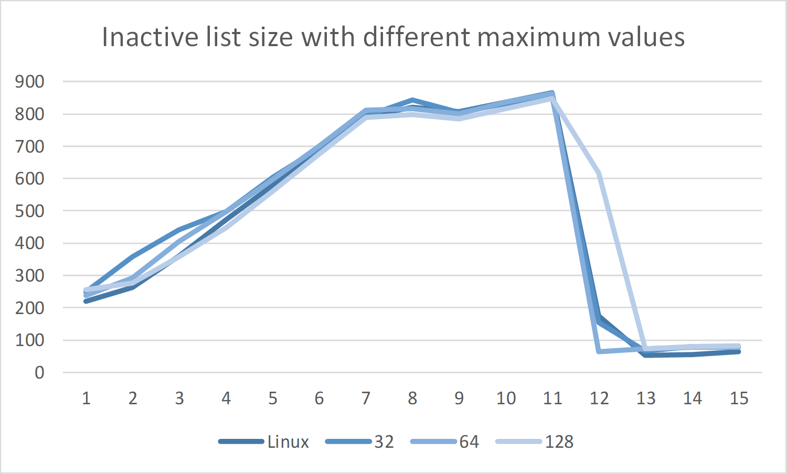

Then the impact of maximum `PG_referenced` value. The higher the maximum, the larger the active list size. That is because larger maximum value allows more states in the active list and makes it harder for a page in the active list to be moved to the inactive one. The maximum value seems to have little effect on the active list size.

## Reference

[1] Understanding the Linux Kernel. Daniel Bovet and Marco Cesati. O'Reilly Media.

[2] Memory mapping - The Linux Kernel documentation. https://linux-kernel-labs.github.io/master/labs/memory_mapping.html

[3] Android OS boot process with focus on Zygote. https://blog.codecentric.de/en/2018/04/android-zygote-boot-process/

